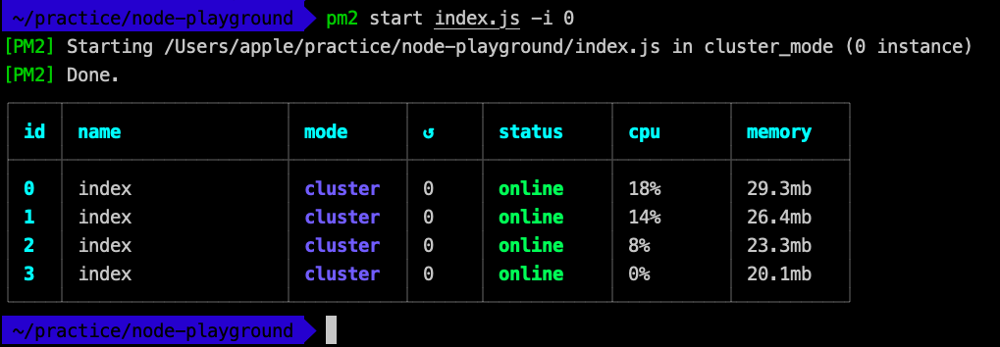
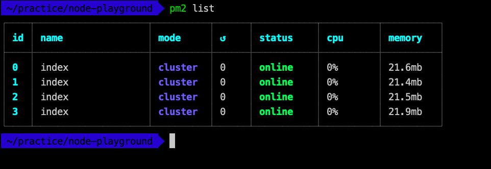
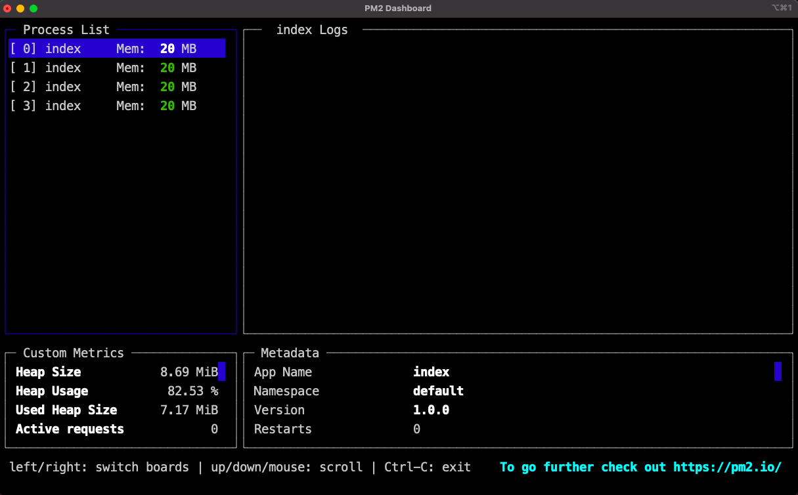
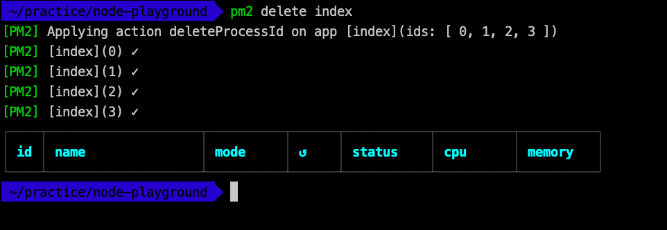

We all are familiar with deploying nodejs application on a server. The 
question is, are we making the most out of the server?   

By default, when you run an application, node will use a single 
thread. 

Consider the following example node file, $app.js$.

```js
const express = require("express");
const app = express();

const PORT = process.env.PORT || 5050;

const work = (i = 0) => {
    while (i < 1e10) i++;
};

app.get("/work", (req, res) => {
    work();
    res.send({ message: "✨ Hello, World! ✨" });
});

app.get("/no-work", (req, res) => {
    res.send({ message: "✨ Hello, World! ✨" });
});

app.listen(PORT, () => {
  console.log(`Listening on http://localhost:${PORT}`);
});
```

<br>

Let us see what the application does. It has two route handlers:
* $GET$ `/no-work` <br>
which just returns a `Hello World` JSON response.
<br> <br> 
* $GET$ `/work` <br>
which also returns a `Hello World` JSON response but 
before that, it also does some ***blocking*** work. That work is 
simulated by incrementing a variable, $10^{10}$ times. 

<br>

Now, if you open a browser, or any API testing tool, and in one tab, 
make a request to `http://localhost:5050/work` and immediately, open a 
new tab and make a request to `http://localhost:5050/no-work`, you will 
see that both the tabs are in a loading state. 

<br>

It is happening because, when we make a request to `/work`, it starts a 
***blocking*** work and during that time, node cannot do anything else. 
So, the request `/no-work` stays on-hold until the previous ***blocking*** 
task is completed. As soon as the ***blocking*** work is completed, node 
continues with the other remaining work and reponds to the `/work` request 
and `/no-work` request. 

<br>

> On a side note, if you want your server to do such high computations or 
CPU intensive work, then **Node JS** won't be the best choice for the 
server. You can look into languages like **C++**, **Java**, **Golang**, 
etc.

<br> 

You won't always have such CPU intensive work in the Node server, but 
even if your Node server is running less computationally inexpensive code, 
there is some (though not significant) delay. Assume, there are over $1000$ 
different users using your app. A single NodeJs thread won't be able 
to respond to all the users, instantaneously. We need more instances to 
handle these many users. The most obvious solution would be to run our 
application on different ports.

```shell script
$ node app.js --port=3001
$ node app.js --port=3002
$ node app.js --port=3003
...
```

And then, we can create a Load Balancer, to manage the request-redirection 
to different ports. This is not wrong, but we have something better. 

<br> 

Node provides us with a module called `cluster`. This, basically, just 
helps us launch our app on same port, but different threads will be 
created to handle the requests.

```js
const cluster = require("cluster");
const express = require("express");
const app = express();

// Routes Handling: start
// ...
// Routes Handling: end

if (cluster.isMaster) {
  const coresCount = 4; // Number of logical cores on machine
  for (let i = 0; i < coresCount; i++) {
    cluster.fork();
  }
} else {
  app.listen(3000);
}
```

The above example creates 4 child instances of the Master thread. Now, 
if we make a request to `/work` and, immediately after, `/no-work`, 
we will get instantaneous response for `/no-work` as `cluster` module 
detects that child 1 is busy doing CPU intensive work, so, it makes child 
2 or 3 or 4, process the `/no-work` request. 

> `Number of Logical cores` is the ideal number of children forks. 
> Anything less is not great (obviously), and anything more is also not 
> great. Why? Consider, my machine has 2 logical cores, and I make 2 
> forks in my node-app. Now, when I make 3 simultaneous requests, 2 requests
> will be assigned to the 2 forks and start processing. Then, when any one
> of them completes, its response will be sent to the user, and the request 
> 3 will start processing. So, if a request takes 1 sec to process, request 
> 1 and request 2 were served in about 1 second and request 3 was served in 
> 2 seconds. Now suppose, we had made 3 forks in the node-app. When 3 requests 
> arrive in the application, They all will be assigned to the 3 threads (forks), 
> and our Operating System will start to process them. There is a thing 
> called process, or thread, starving. Almost all Operating Systems 
> have implemented some process-scheduling algorithms that do not let any 
> thread, or process, starve. So, if there are many threads, or processes, 
> in a process queue, it will use some kind of algorithm (eg. Round Robin),
> to let each thread do some work after it has been waiting for a while. 
> So, each request will be processed simultaneously. This looks good at a 
> first glance, but check the math. Each request has to take 1 second to 
> serve. So, a total of 3 seconds. But we have 2 logical cores. So, the 
> 3 seconds of work will be distributed and each core will do 1.5 seconds 
> of work. So, each request will be responded in 1.5 seconds. Let's scale 
> this up a bit. Assume 100 different users make simultaneous requests. 
> In the scenario where we had 2 (equal to logical cores) forks, first 2 
> request will be responded in 1 seconds, next 2 will be responded at the 
> end of 2 seconds, next 2 will be responded at the end of 3 seconds, and 
> so on. In the scenario where we had more forks than the number of 
> logical cores, for example, 3 forks, first 3 requests will be responded 
> in 1.5 seconds, next 3 at the end of 3 seconds, next 3 at the end of 4.5 
> seconds, etc.

|Request No.|Forks(2) == No. of Logical cores(2)|Forks(3) > No. of Logical cores(2)|
|:----------:|:-------------:|:-------------:| 
|1 |1 second|1.5 seconds|
|2 |1 second|1.5 seconds|
|3 |2 seconds|1.5 seconds|
|4 |2 seconds|3 seconds|
|5 |3 seconds|3 seconds|
|6 |3 seconds|3 seconds|
|7 |4 seconds|4.5 seconds|
|8 |4 seconds|4.5 seconds|
|9 |5 seconds|4.5 seconds|
|10|5 seconds|6 seconds|
|11|6 seconds|6 seconds|
|12|6 seconds|6 seconds|
|13|7 seconds|7.5 seconds|
|14|7 seconds|7.5 seconds|

<br>

If you had forked 10 times instead of 3, then the first 10 requests 
would have taken 5 seconds and each subsequent 10 request would have 
to wait for the previous requests to complete. Clearly, the 
`Forks == No. of Logical cores`, is the best choice.

<br><br>

If any of the cluster crashes, we can write a script that will restart it. 
We can also add monitoring and all good stuff for each of the clusters. 
But that is a lot of manual work. There exists a module called `pm2` 
which does all of this for us. 

Install this globally on the server:
```shell script
$ npm i -g pm2
``` 

Consider the following `app.js` file (without any clustering code),
```js
const express = require("express");
const app = express();

const PORT = process.env.PORT || 5050;

app.get("/", (req, res) => {
    res.send({ message: "✨ Hello, World! ✨" });
});

app.listen(PORT, () => {
  console.log(`Listening on http://localhost:${PORT}`);
});
```

To start this, run
```shell script
$ pm2 start app.js -i 0
# -i -> Number of instances and if 0, 
# then defaults to no. of logical cores.
```
 

<br>

To list all running instances, 
```shell script
$ pm2 list
```


<br>

To monitor, 
```shell script
$ pm2 monit
```


<br>

To stop running instances, 
```shell script
$ pm2 delete index
# index is the name of the instance. 
```



<br><br>

What if the server crashes? We can configure the server to restart on 
crash but then our pm2 instances will be stopped. To make the pm2 
auto-start on server restart, we run:

```shell script
$ pm2 startup
# Make pm2 auto-boot at server restart
``` 

<br><br>

> All this can be done by using SSH to connect
> to the server and running the commands in the
> SSH-connected terminal of the server. 

<br>

This was just a brief intro to PM2. To learn more, visit 
[pm2.io](http://pm2.io/ "More info on PM2").

<br>

I hope this helped you. Drop a react on the post and/or comment below. 
✨✨✨
